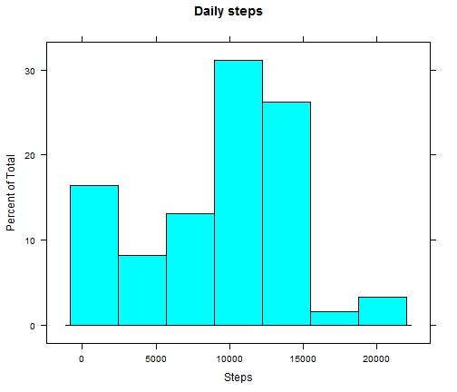
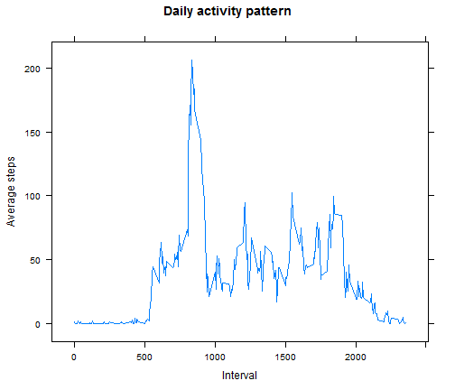
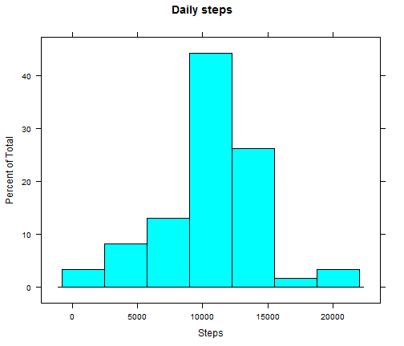
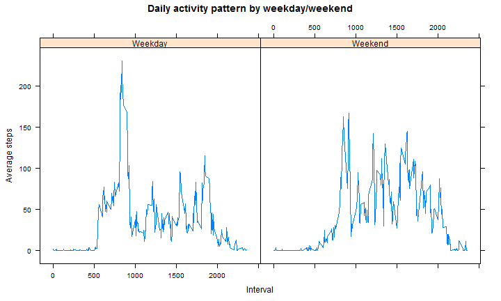

# Reproducible Research: Peer Assessment 1

This assignment makes use of data from a personal activity monitoring device. This device collects data at 5 minute intervals through out the day. The data consists of two months of data from an anonymous individual collected during the months of October and November, 2012 and include the number of steps taken in 5 minute intervals each day.

## Loading and preprocessing the data

We begin by reading the input file. The variables included in the dataset are:

* **steps:** Number of steps taking in a 5-minute interval (missing values are coded as NA).
* **date:** The date on which the measurement was taken in YYYY-MM-DD format.
* **interval:** Identifier for the 5-minute interval in which measurement was taken.


```r
library(lattice)
```

```
## Warning: package 'lattice' was built under R version 3.0.3
```

```r
library(lubridate)
```

```
## Warning: package 'lubridate' was built under R version 3.0.3
```

```r
setwd("C:/Users/orojuan/Documents/Data Science/Reproducible/RepData_PeerAssessment1")
if (!file.exists("./activity.csv")) {
    unzip("./activity.zip")
}
mydf <- read.csv("./activity.csv", colClasses = c("numeric", "character", "numeric"), 
    comment.char = "")
mydf[, 3] <- factor(mydf[, 3], ordered = T)
mydf[, 2] <- as.Date(mydf[, 2])
```


**NOTE:** Date field was coerced as Date class, whereas Interval field was converted to an ordered factor.


## What is mean total number of steps taken per day?

This is a histogram of the total number of daily steps:


```r
daily <- with(mydf, tapply(steps, date, sum, na.rm = T))
histogram(daily, main = "Daily steps", xlab = "Steps")
```




According to the data, the mean total number of steps taken per day is **9354.2295**, while the median is **1.0395 &times; 10<sup>4</sup>**. This shows a negative skew in the distribution.


## What is the average daily activity pattern?

This is a time series plot of the 5-minute interval (x-axis) and the average number of steps taken, averaged across all days (y-axis):


```r
avginter <- with(mydf, tapply(steps, interval, mean, na.rm = T))
xyplot(avginter ~ as.numeric(names(avginter)), type = "l", main = "Daily activity pattern", 
    xlab = "Interval", ylab = "Average steps")
```




From the previous plot, we can see that the interval with the maximum average steps is **835**.


## Imputing missing values

There are a total of **2304** missing values (coded as NA). The presence of missing days may introduce bias into some calculations or summaries of the data. Therefore, we have filled in all of those by using the rounded mean of the  corresponding 5-minute intervals:


```r
mydf2 <- mydf
mydf2$steps[is.na(mydf$steps)] <- round(avginter[mydf$interval[is.na(mydf$steps)]])
```


After dealing with missing data, this is how the histogram of total number of daily steps looks like:


```r
daily2 <- with(mydf2, tapply(steps, date, sum))
histogram(daily2, main = "Daily steps", xlab = "Steps")
```




Please notice that this time, both the mean **1.0766 &times; 10<sup>4</sup>** and the median **1.0762 &times; 10<sup>4</sup>** are almost the same, suggesting a symmetric distribution (Skewness has disappeared).


## Are there differences in activity patterns between weekdays and weekends?

This is a panel plot containing a time series plot of the 5-minute interval (x-axis) and the average number of steps taken, averaged across all weekday days or weekend days (y-axis):


```r
mydf2$wday <- ifelse(wday(mydf2$date)%%7 < 2, "Weekend", "Weekday")
jn <- with(mydf2, tapply(steps, interaction(interval, wday), mean))
sn <- unlist(strsplit(names(jn), ".", T))
xyplot(jn ~ as.numeric(sn[seq(length(jn))%%2 == 1]) | sn[seq(length(jn))%%2 == 
    0], type = "l", main = "Daily activity pattern by weekday/weekend", xlab = "Interval", 
    ylab = "Average steps")
```



